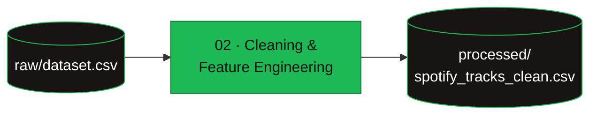

# Data

## Source
[Spotify Tracks Dataset](https://www.kaggle.com/datasets/maharshipandya/-spotify-tracks-dataset)
(Maharshi Pandya, Kaggle). Each row is a track with metadata, a `popularity` score
(0–100) and audio features (danceability, energy, loudness, valence, etc.).

## Files

| File | Role |
|---|---|
| `raw/dataset.csv` | Raw input, as downloaded. |
| `processed/spotify_tracks_clean.csv` | Cleaned, modeling-ready table. |

The cleaned table is produced from the raw one by the cleaning notebook:

It is committed so the modeling notebooks run without re-running the cleaning step; to
rebuild it, run notebook 02.

## Engineered columns (added during cleaning)
- `duration_min` — duration in minutes.
- `is_explicit` — explicit flag as `{0, 1}`.
- `popularity_class` — popularity tertiles (`qcut`): Low / Medium / High.
